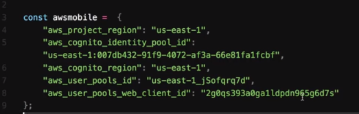

## Launch Darkly Flag List with TypeScript React & Redux

This application grab the list of feature flags from Launch Darkly and display it on UI.

What does it include?
- Dashboard: flag counts and bar graph for monthly flag created counts
- Feature Flag List Table
- Filtering the list by user name.
- Download the list as CSV file.
- AWS Cognito Sign In

## Setting up

(1) Install modules with npm i

(2) Create a config folder at the root level

(3) Create a JSON file in the config folder with API key and Endpoint for Launch Darkly

```json
{
  "token" : "<api token key",
  "apiUrl": "endpoint uri: for example - https://app.launchdarkly.com/api/v2/flags/default?env=production"
}
```
(4) Create aws-exports.ts in the config folder and add the appropriate values to use AWS Cognito.

```javascript
const awsmobile = {
  "aws_project_region": "",
  "aws_cognito_identity_pool_id": "",
  "aws_cognito_region": "",
  "aws_user_pools_id": "",
  "aws_user_pools_web_client_id": ""
};

export default awsmobile;
```
It should look like this




